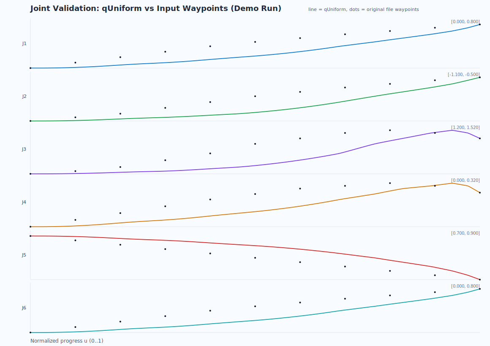

# LoongEnv-SHIZE

LoongEnv Desktop Workspace: Designed for robot simulation, trajectory planning, and diagnostics. As the underlying algorithms require Python support, a real-time frontend preview is currently not available.

## What is included

- React + Vite frontend (`src/`)
- Local Node sidecar API (`server/api.mjs`)
- Python planning bridge (`scripts/planning_bridge.py`)
- `fixed_toppra_mvc_ruckig` planner package (in-repo)
- Robot assets for MuJoCo/URDF under `public/robots/`

## Prerequisites

- Node.js 18+
- Python 3.10+
- npm

## Quick Start

1. Install Node dependencies:

```bash
npm install
```

2. Install Python dependencies:

```bash
pip install -r fixed_toppra_mvc_ruckig/requirements.txt
```

3. (Optional) If `python` is not in PATH, set planner python executable:

```bash
# PowerShell
$env:PLANNER_PYTHON="C:\\Path\\To\\python.exe"
```

4. Start frontend + API together:

```bash
npm run dev:stack
```

5. Open:

- Frontend: `http://localhost:3000`
- Sidecar health: `http://localhost:3001/api/design/planning/health`

## Useful Scripts

- `npm run dev` - start frontend only
- `npm run dev:api` - start sidecar API only
- `npm run dev:stack` - start both frontend and API
- `npm run lint` - TypeScript type-check
- `npm run build` - production build

## Notes

- First version uses local one-shot planning requests (no queue/streaming).
- Planning output drives the center 3D simulation playback (`qUniform/tUniform`).

## Algorithm Docs & Effect Images

- Detailed algorithm design doc: [docs/ALGORITHM.md](./docs/ALGORITHM.md)
- Demo run summary data: [docs/planning_demo_summary.json](./docs/planning_demo_summary.json)

Preview:



