# LoongEnv-SHIZE

LoongEnv Desktop Workspace: Designed for robot simulation, trajectory planning, and diagnostics. As the underlying algorithms require Python support, a real-time frontend preview is currently not available.

## What is included

- React + Vite frontend (`src/`)
- Local Node sidecar API (`server/api.mjs`)
- Python planning bridge (`scripts/planning_bridge.py`)
- `fixed_toppra_mvc_ruckig` planner package (in-repo)
- Robot assets for MuJoCo/URDF under `public/robots/`

## Prerequisites

- Node.js 18+
- Python 3.10+
- npm

## Quick Start

1. Install Node dependencies:

```bash
npm install
```

2. Install Python dependencies:

```bash
pip install -r fixed_toppra_mvc_ruckig/requirements.txt
```

3. (Optional) If `python` is not in PATH, set planner python executable:

```bash
# PowerShell
$env:PLANNER_PYTHON="C:\\Path\\To\\python.exe"
```

4. Start frontend + API together:

```bash
npm run dev:stack
```

5. Open:

- Frontend: `http://localhost:3000`
- Sidecar health: `http://localhost:3001/api/design/planning/health`

## Useful Scripts

- `npm run dev` - start frontend only
- `npm run dev:api` - start sidecar API only
- `npm run dev:stack` - start both frontend and API
- `npm run lint` - TypeScript type-check
- `npm run build` - production build

## Notes

- First version uses local one-shot planning requests (no queue/streaming).
- Planning output drives the center 3D simulation playback (`qUniform/tUniform`).

## 封装发布工作流（GitHub Actions）

仓库已内置发布工作流：

- Workflow 文件：`.github/workflows/release-package.yml`
- 触发方式：
- 推送 tag（`v*`）时自动执行，并自动创建 GitHub Release
- 手动触发（`workflow_dispatch`）时执行打包，可选是否创建 Release

工作流内容：

- 安装依赖并执行 `npm run lint`、`npm run build`
- 生成发布包：`LoongEnv-SHIZE-<version>.zip`
- 生成校验文件：`LoongEnv-SHIZE-<version>.sha256`
- 上传到 Actions Artifacts
- 在满足条件时发布到 GitHub Releases

手动发布建议：

1. 进入 GitHub -> `Actions` -> `Release Package`
2. 点击 `Run workflow`
3. 填写 `release_tag`（例如 `v1.0.0`）
4. 将 `create_release` 设为 `true`

## 运行说明（Design 打磨规划）

1. 启动：`npm run dev:stack`
2. 打开 `http://localhost:3000`，进入 `Design` 面板。
3. 上传 6 轴轨迹文件（CSV 需包含表头 `J1..J6`，或 6 列 TXT）。
4. 设置关节速度/加速度约束与算法参数。
5. 点击 `Run Planning Pipeline` 执行规划。
6. 规划成功后，在 diagnose 区查看摘要与曲线，并通过播放控件联动中间 3D 机器人回放。

## 运行效果图

### 资产库与机器人切换

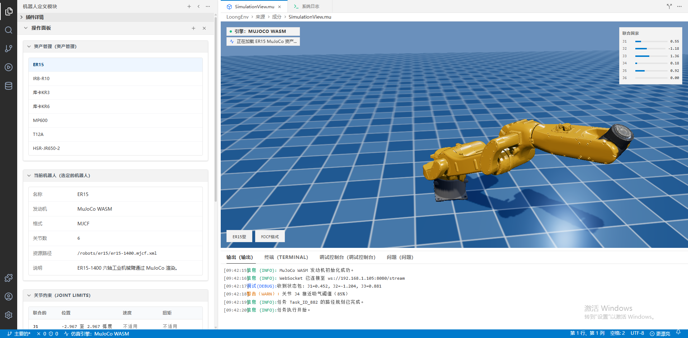
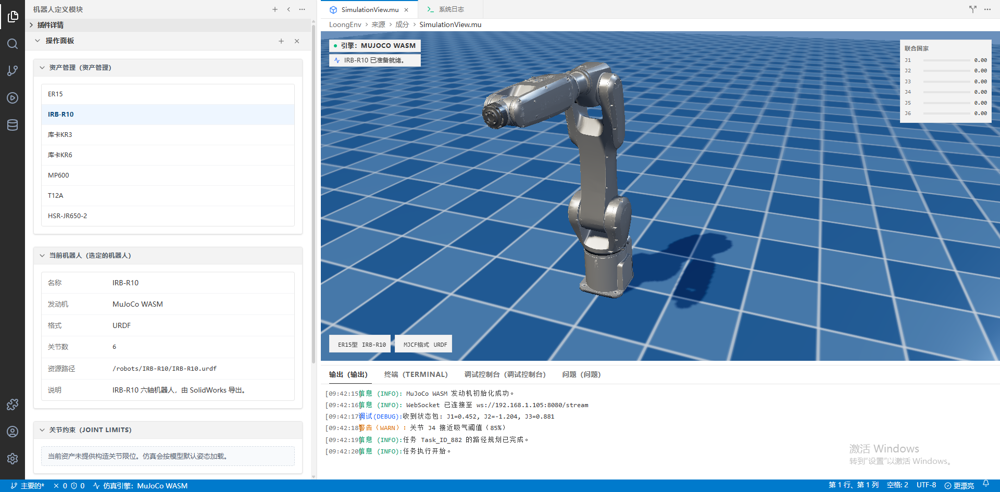
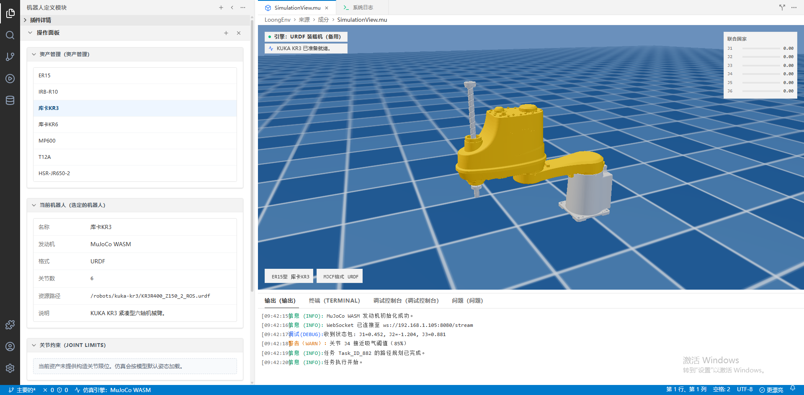
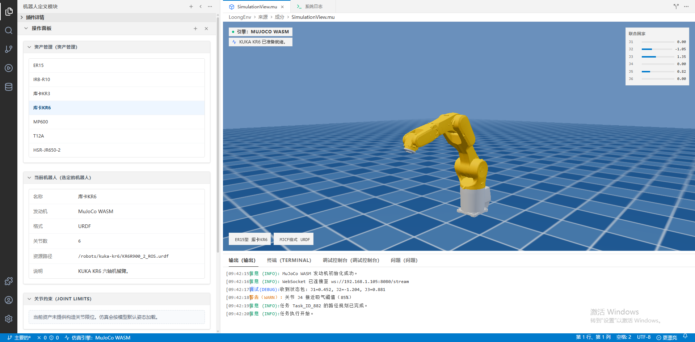
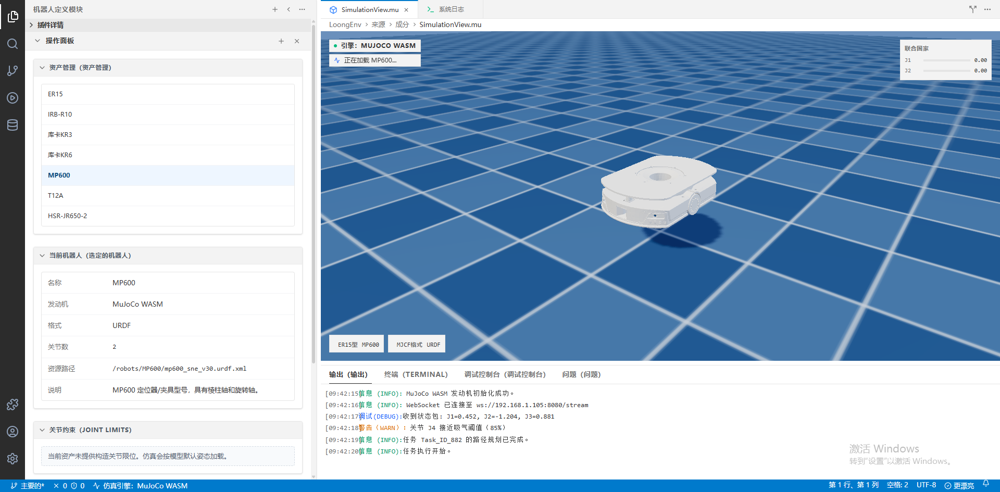
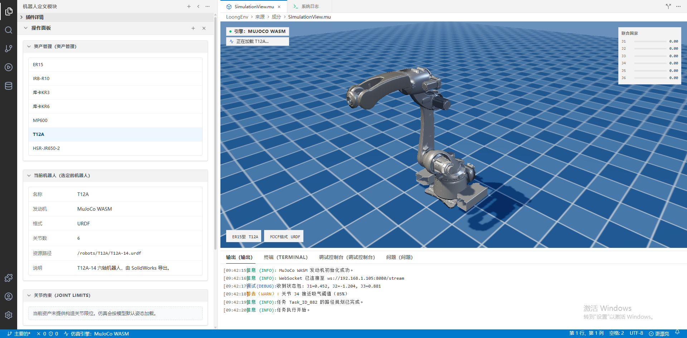
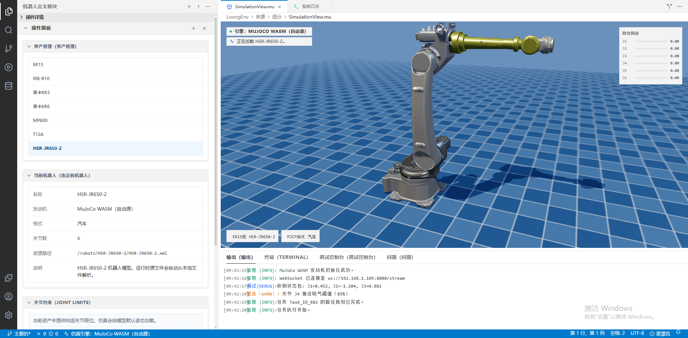

### 打磨规划算法结果

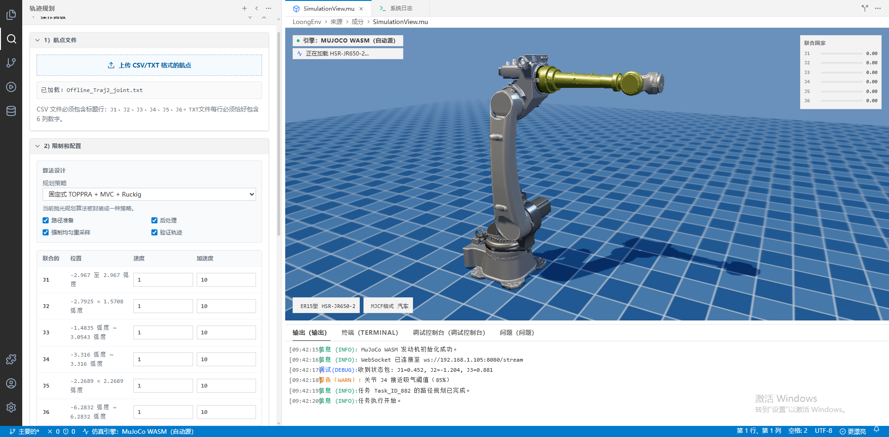
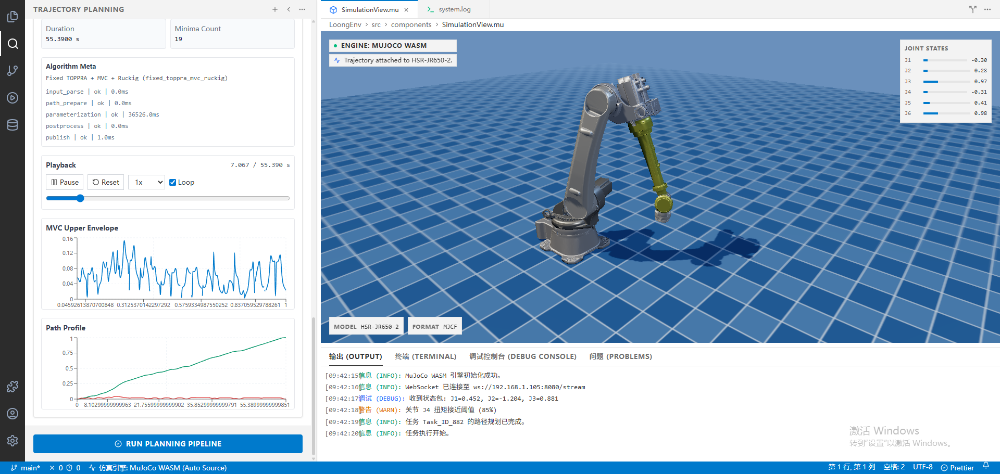
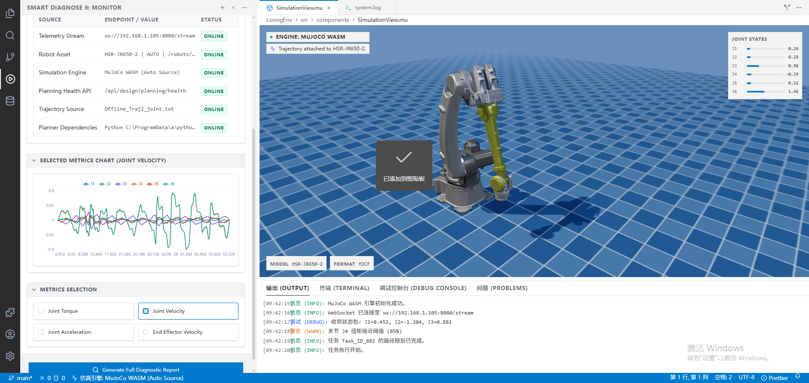
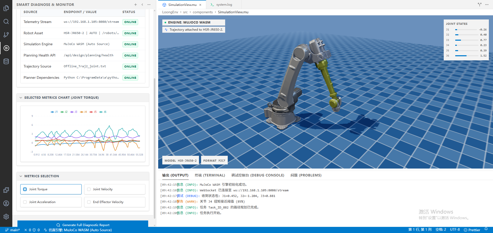


