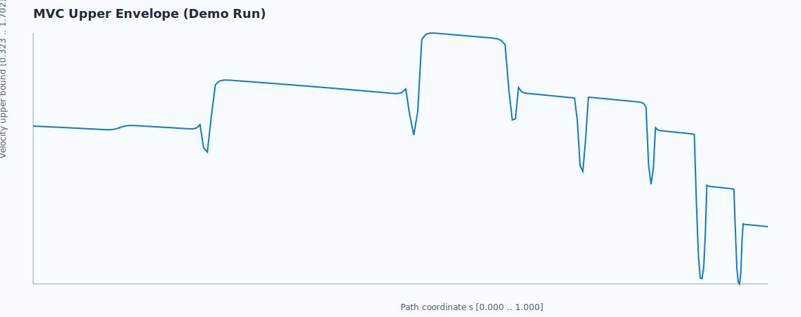
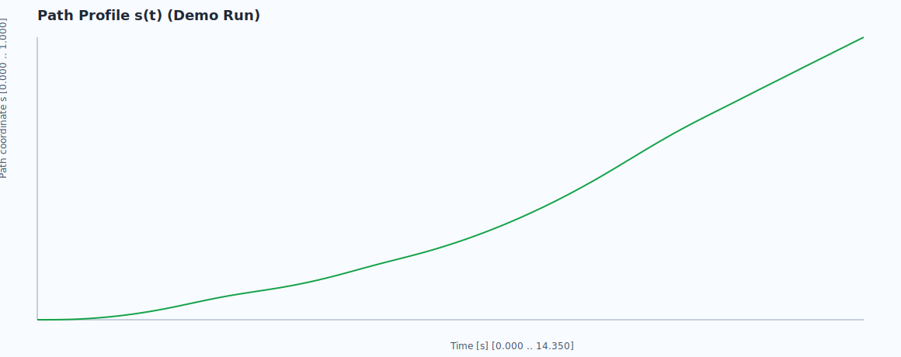
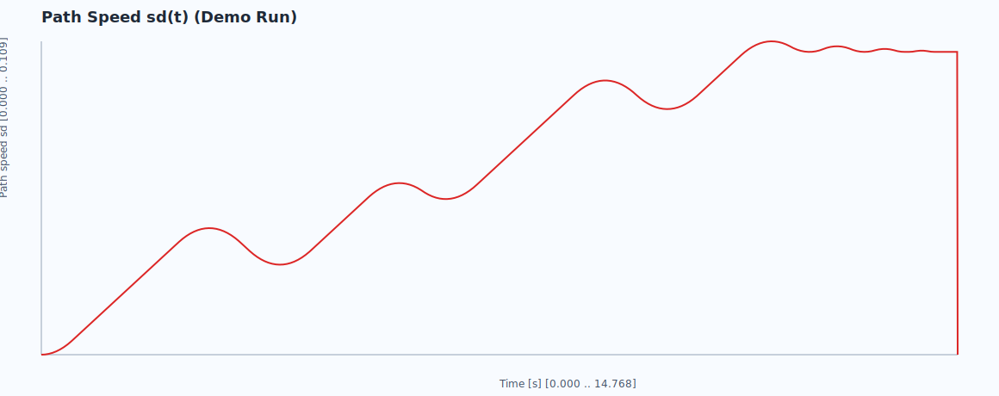
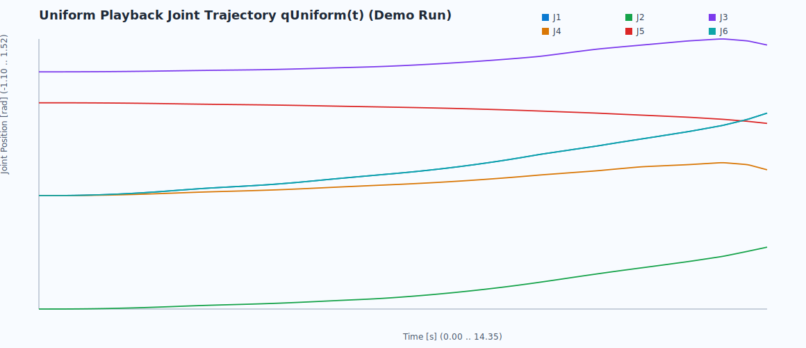

# 打磨规划算法说明（Design 模块）

本文档描述 `fixed_toppra_mvc_ruckig` 在 Design 中的算法流程、接口契约和运行效果。

## 1. 算法目标

输入 6 轴关节路径点（CSV/TXT），输出可回放轨迹：

- 连续时间轨迹：`ts / qs / qds / qdds`
- 统一采样轨迹：`tUniform / qUniform`（用于 3D 回放）
- 约束相关曲线：`mvcUpper`、`pathProfile(s/sd/sdd)`

## 2. 流水线设计

Design 侧采用阶段化流水线（Node sidecar 编排）：

1. 输入解析（`input_parse`）
2. 路径准备（`path_prepare`）
3. 参数化规划（`parameterization`，由 Python bridge 调 `fixed_toppra_mvc_ruckig`）
4. 后处理（`postprocess`，轨迹契约校验/统一采样）
5. 结果发布（`publish`）

每阶段返回：

- `stage`
- `status` (`ok/error/skipped`)
- `durationMs`
- `errorCode`（失败时）

## 3. 核心算法组成

`fixed_toppra_mvc_ruckig` 的规划核心由三部分组成：

- TOPPRA：时间最优参数化基础
- MVC（Maximum Velocity Curve）：速度包络和极小值分段依据
- Segmented Ruckig：分段平滑与 jerk 限制过渡

在当前实现中，默认用于 ER15 的关节路径规划，且保留：

- `ssMode`：`arc | time`
- 最小值阈值模式：`mean/fixed/none`
- 分段目标速度缩放：`junction_velocity_scale`

## 4. API 契约（Design <-> Sidecar）

`POST /api/design/planning/run` 请求字段（关键）：

- `waypointText`, `fileName`
- `limits.velocity[6]`, `limits.acceleration[6]`
- `config`（规划参数）
- `ssMode`, `playbackDtMs`
- `algorithm`
  - `strategyId`（默认：`fixed_toppra_mvc_ruckig`）
  - `stageConfig`（如 `enablePathPreparation`, `enablePostprocess`, `forceUniformResample`）

响应新增字段：

- `algorithmMeta`
- `stageMetrics`
- `debugLogs`
- 失败统一语义：`stage/errorCode/message`

## 5. 运行效果图（真实样例运行）

样例输入：`public/samples/er15_waypoints_sample.csv`

演示摘要：见 [planning_demo_summary.json](./planning_demo_summary.json)

### 5.1 MVC 上包络



### 5.2 路径坐标曲线 s(t)



### 5.3 路径速度曲线 sd(t)



### 5.4 六关节统一采样轨迹 qUniform(t)



## 6. 复现命令

```bash
# 1) 安装依赖
npm install
pip install -r fixed_toppra_mvc_ruckig/requirements.txt

# 2) 启动前后端
npm run dev:stack

# 3) 打开
# http://localhost:3000
```

重新生成文档效果图：

```bash
python scripts/generate_planning_docs_artifacts.py
```

> 说明：本文档图像由仓库内脚本运行结果生成，用于展示当前实现的可运行效果。
